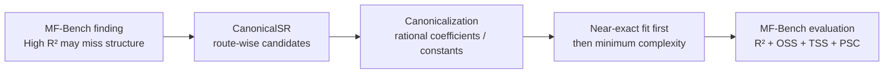

# CanonicalSR 墙报蓝图（Poster Blueprint）

> 用途：第 14 期方法墙报的逐面板文案与配图方案，可直接排版
> 定位：**不与 MF-Bench 竞争，而是承接它提出的问题，给出一个 label-blind 的求解策略**
> 数据依据：`results/core_first20.json`、`ablation_first20.json`、`heldout20.json`、`case284.json`

**CanonicalSR：以"符号恢复（canonical recovery）"为选解准则的符号回归（symbolic regression）。**

---

## P0 · 标题区

**CanonicalSR: Multi-route Symbolic Regression for Canonical Recovery of Materials Formulas**

*A metric-aligned, label-blind response to the structural-recovery gap revealed by MF-Bench*

中文口头：**面向材料公式规范恢复的多路线符号回归**
——任务是符号回归（只给 `(X,y)`），目标是符号恢复（规范、结构正确）；
评价目标对齐 MF-Bench，但求解过程对真式和结构标签盲化。

---

## P1 · 问题（承接 MF-Bench 的发现，置于墙报上方）

**核心论断（大字）：**

> **High R² does not guarantee recovery of the physical structure of a materials formula.**

- MF-Bench 把评价从拟合误差扩展到三维结构指标：
  **OSS**（算子语义）、**TSS**（表达式树拓扑）、**PSC**（物理结构块）；
- 五种代表性 SR 方法（PySR / QLattice / GE / GPZGD / Operon）的实验表明：
  一些方法 **R² 很高，但 TSS、PSC 明显偏低**；
- 含义：数值拟合好 ≠ 科学公式被恢复。材料研究最终需要的是
  结构正确、可读、可外推的闭式式。

> 口头要点：问题和评价标尺是 MF-Bench 给的；
> CanonicalSR 回答"求解器该怎么设计"。

---

## P2 · 中央主张（墙报中央的大句子）

> **Metric-aligned, label-blind symbolic recovery for materials formulas**

中文：**评价目标对齐，但求解过程对真式和结构标签盲化。**

| | 说明 |
|---|---|
| **Metric-aligned** | 目标与 MF-Bench"结构恢复优先"的理念一致 |
| **Label-blind** | 求解阶段**只输入 `(X, y)`**；不读取真式、OSS、TSS、PSC、公式库 |
| 真式与结构指标 | 仅在最终评价阶段使用，不进入搜索与选解 |

> 回应质疑"你是不是用了真公式或 PSC 模板？"：没有。

---

## P3 · 核心图：拟合几乎相同，科学含义根本不同

图标题：

> **Nearly identical fit can yield fundamentally different scientific expressions**

案例：MF-bench **idx4**（n=400，σ=0）

| | Fit-oriented candidate（纯按误差） | **CanonicalSR canonical candidate** |
|---|---|---|
| 表达式 | `0.16666666046879·x₃x₄/x₀ + 0.166666667043909·x₂x₅/x₁ + 8.07·10⁻⁶` | **`(1/6)·x₃x₄/x₀ + (1/6)·x₂x₅/x₁`** |
| NRMSE | **3.52·10⁻⁸（甚至略低）** | 4.90·10⁻⁸ |
| 系数 | 脏系数逼近 1/6 + 微小截距 | 干净有理系数 1/6、无冗余截距 |
| 严格代数等价 SE | **False** | **True** |

要点：**纯按误差会选中"拟合略好但结构错误"的式子**；
CanonicalSR 在近似精确后优先取最简规范式——误差代价可忽略（~1e-8），
结构正确性完全不同。

---

## P4 · 四大优势（算法事实，逐一可查）

| 墙报表达 | 算法事实 |
|---|---|
| **Metric-aligned, label-blind recovery** | 目标对齐 MF-Bench 结构恢复理念；求解阶段不读真式与 OSS/TSS/PSC |
| **Canonical equation recovery** | 系数与指数吸附到有理数/常见常数，抑制逼近 1 的脏系数、微小截距与补偿项 |
| **Route-wise structural recovery** | 不在完整表达式树盲搜；分路线处理乘幂、差分幂、线性分母、稀疏耦合项与残差结构 |
| **Explicit failure boundary** | 深嵌套分式、超越函数、噪声情形被明确暴露为模型族覆盖不足，而非输出貌似可信的复杂式 |

### 方法流（路线示意）

五条恢复路线（各只用 `(X,y)`）：

| 路线 | 恢复的结构 | 方法 |
|---|---|---|
| logspace | `c·Π xₖ^{pₖ}` | 取对数 → OLS → 有理吸附 |
| logdiff | `c·Πx^p·Π(xᵢ−xⱼ)^q` | 对数 + 差分原子 + 共线守卫 |
| linear_denom | `monomial / (1+a·xᵢ)` | 有理 `a` 扫描，复用 logdiff |
| narrow | 稀疏加法（比值/对数比值） | 窄字典贪心 + 验证早停 + 后向剔除 + 多起点 |
| recursive | 残差剥层 + exp/log 外壳 | 原子库贪心 + 系数有理吸附 |

**统一选解规则**：NRMSE<1e-4 的候选里取算子最少；
门内无人则取 NRMSE 最小；便宜路线 <1e-6 短路。
**只在同等精度内取简，绝不因简洁牺牲拟合。**

---

## P5 · 结果：分两个层次报告（增强可信度）

### Tier 1 — Development-aligned core set（first-20）

| 指标 | CanonicalSR |
|---|---|
| n = 400，σ = 0，seed 0 / 独立复核 seed 7，float64 | |
| **严格结构恢复 SE** | **17/20（85%）** |
| **独立新数据严格等价** | **18/20（90%）** |

消融（同数据、同源候选，逐级加机制）：

| 档 | SE |
|---|---|
| A 仅按误差选解 | 9/20 |
| B + 简洁性（有理吸附） | 15/20 |
| C 完整多路线（+多起点） | **17/20** |

→ 提升来源：**A→B（+6）规范/简洁选择；B→C（+2）多路线覆盖**；两步均不丢解。

### Tier 2 — Unseen-formula holdout（未参与设计）

| 指标 | 结果 |
|---|---|
| 20 条设计期完全未接触公式，固定种子自动分层抽取 | |
| **跨公式严格恢复 SE** | **8/20（40%）** |
| 独立新数据严格等价 | 10/20（50%） |

> **The route library recovers a substantial subset of common
> materials-formula motifs, while performance drops on unseen structures
> outside the current structural families.**

- **85% 不是泛化能力**（first-20 在开发中见过）；**40% 也不是失败**，
  而是当前路线族覆盖范围的诚实测量；
- 同公式换种子只证明采样稳定性（恢复成功的公式跨 3 种子结果一致），
  不作为泛化证据。

---

## P6 · 显式失败边界（诚实面板）

当前路线族**明确不覆盖**：

1. **深嵌套分式**（first-20 中 idx11、idx19）；
2. **含超越函数结构**（ln/exp/sin/cos 与上述族的组合；留出测试 0/3）；
3. **含噪数据**：σ>0 时精确路线的"精确性门"不触发；
4. 加法分母有理函数、`exp` 套比值、`sqrt(x²−c)` 等族（已在 Feynman 集定位）。

CanonicalSR 对这些问题输出**"低覆盖 / 无候选"**，而不是给一个貌似可信的装饰式。

> 后续工作 STAR-SR（见 `PLAN_STAR-SR.md`）：用似然比检验替代硬阈值、
> 输出结构置信集、主动实验消解歧义——主攻噪声与不确定性。

---

## P7 · 结论（收束句）

> **MF-Bench shows that scientific formula discovery requires more
> than fit quality. CanonicalSR introduces a label-blind, route-wise
> recovery strategy that favors canonical expressions when several
> candidates fit the data equally well.**

---

---

## 配套交付物（墙报直接引用）

| 交付 | 路径 | 生成脚本 |
|---|---|---|
| 算法伪代码 | `experiments/PSEUDOCODE.md` | — |
| 方法对比（左：iMCTS/PySR/LLM-SR/CanonicalSR 恢复率；右：103 未接触公式泛化瓦片） | `results/figures/method_comparison.png / .pdf` | `experiments/make_method_comparison.py` |
| 结果总览（旧版） | `results/figures/results_overview.png / .pdf` | `experiments/make_results_overview.py` |
| 痛点图（idx284，真实 GP 基线 vs 规范恢复；400 点残差曲线） | `results/figures/baseline_compare.png / .pdf` | `experiments/make_baseline_compare.py`（dyfesr_env 运行） |
| 痛点图（备选：e^{2x} vs e^{2x}cos(x³)） | `results/figures/painpoint_v2.png / .pdf` | `experiments/make_painpoint_v2.py` |
| 痛点图（多项式替身版，备选） | `results/figures/compare_panel.png / .pdf` | `experiments/make_compare_panel.py` |
| 消融表 | `results/tables/ablation.md / .csv` | `experiments/make_tables.py` |
| 核心结果表 | `results/tables/core_results.md / .csv` | 同上 |
| 留出结果表 | `results/tables/heldout20.md / .csv` | 同上 |

---

## 排版与口径备忘

- 叙事顺序：问题（P1）→ 主张（P2）→ 对照图（P3）→ 方法（P4）
  → 分层结果（P5）→ 边界（P6）→ 结论（P7）；
- **不**主打：iMCTS 命名依据、"优于所有主流 SR"、5 倍外推、
  噪声鲁棒、physics-informed、LLM-SR / MCTS-SR；
- 协议固定：n=400、σ=0、seed=0/7、**float64**（float32 的 `y` 会产生
  补偿垃圾项，详见 `REPORT.md §2.2`）；
- 全部数字可由脚本一键复现：
  `reproduce_core.py / ablation.py / heldout20.py / case_284.py`。
