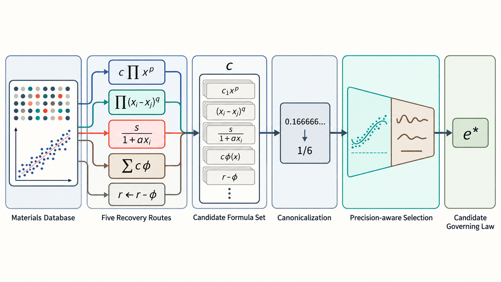

# CanonicalSR — Label-Blind Multi-Route Canonical Symbolic Regression

**CanonicalSR** is a symbolic-regression solver that uses only the data `(X, y)`:
it never sees the target formula, needs no formula library, and trains no neural
network. Its goal is to recover a **structurally correct closed-form expression
with clean (rational / standard-constant) coefficients** — not merely a curve
that fits numerically.



On noiseless data, CanonicalSR achieves **17/20 strict structural recoveries**
on the first 20 MF-Bench formulas, whereas iMCTS reaches 5–6/20 — even though
both fit the training data with R² ≈ 0.98.

---

## Why it is needed

Classical symbolic regression (genetic programming, reinforcement learning,
MCTS) is rewarded almost entirely on fit error. As a result, many expressions
reach **R² ≈ 1 in the observed range while being "decorative" structures**:
they match locally but deviate sharply on independent data.

CanonicalSR solves over several **canonical model families** and selects with
**near-exact fit first, and among equally exact fits, the fewest operators**.
This suppresses numerically equivalent but bloated decorations.

## Five recovery routes

| Route | Models represented | Method |
|---|---|---|
| `logspace` | pure products of powers `c·Π x_k^{p_k}` | log-transform → linear regression → snap exponents to a rational grid |
| `logdiff` | difference-root forms `c·Π x^p·Π(x_i−x_j)^q` | logarithms + `log(x_i−x_j)` atoms + collinearity guard |
| `linear_denom` | linear denominator `monomial / (1 + a·x_i)` | scan rational `a`; rebuild when the numerator matches a monomial |
| `narrow` | sparse additive forms (incl. ratios / log-ratios) | narrow dictionary + standardized greedy fit + validation early-stop + backward elimination + multiple starts |
| `recursive` | layer-wise residual stripping with `exp/log` shells | atom-library greedy fit + rational coefficient snapping |

**Unified selection rule**

1. Collect candidates from every route and compute their true NRMSE on the data.
2. Among the *near-exact* candidates (NRMSE < 1e-4), take the one with the
   **fewest operators**.
3. If none is near-exact, take the candidate with smallest NRMSE.

> Formally, CanonicalSR can exactly recover a target **if and only if** the
> target lies in the union of the model families above (with exponents on the grid).

## Installation

```bash
pip install -e .
```

Dependencies: `numpy`, `sympy`.

## Quick start

```python
import numpy as np
from scesr import solve_union

# X: (n_samples, n_features)   y: (n_samples,)
r = solve_union(X, y)
print(r["expression"], r["route"], r["nrmse"])
```

Command-line demo (needs the MF-Bench dataset to generate examples):

```bash
python examples/run_demo.py 52     # problem index
```

Build a benchmark problem with the built-in generator:

```python
from scesr import gen
d = gen(idx=52, n=400, sigma=0.0, seed=0)
X, y = d["X"].T, d["y"]
```

## Results

### First-20, noiseless (400 samples/formula)

| Method | strict structural recovery |
|---|---|
| iMCTS | 5/20 (25%) |
| PySR | 9/20 (45%) |
| LLM-SR (DeepSeek + coefficient refinement) | 0/20 (0%) |
| **CanonicalSR** | **17/20 (85%)** |

On independent fresh data, CanonicalSR passes 18/20. The unrecovered cases are
the deeply nested fractions (idx 11 and 19 in the first 20).

The ablation (same data, same candidate origin) isolates the source of the gain:

| Level | Mechanism | SE |
|---|---|---|
| A: error-only | generic sparse search, argmin NRMSE | 9/20 |
| B: + simplicity | rational coefficient snapping; fewest operators within NRMSE < 1e-4 | 15/20 |
| C: full multi-route | + all route families and narrow restarts | **17/20** |

### Beyond the 20: generalization

On **103 formulas never used in design**, CanonicalSR recovers **43/103 (42%)**,
showing the framework is not limited to the development set.

## Reproducing the experiments

The full protocol (code version, formula IDs, seeds, noise definitions, compute
budget, selection rule), ablations, cross-formula generalization, and the
detailed case are in **[REPORT.md](REPORT.md)**.

```bash
python experiments/reproduce_core.py   # core: first-20 SE 17/20
python experiments/ablation.py         # ablation: 9 -> 15 -> 17
python experiments/heldout20.py        # unseen-formula holdout: 8/20
python experiments/case_284.py         # detailed fracture-toughness case
```

> Protocol note: exact routes require the clean **float64** target `yc`; feeding
> the float32 `y` directly produces garbage compensation terms from rounding
> residuals (see REPORT.md §2.2).

## Current limitations (stated honestly)

- **Noise robustness is a known gap**: strict recovery drops at σ = 0.05 because
  the exact-route "exactness gate" does not trigger under noise. Robust
  noise-tolerant structural identification is the main next step.
- The OSS/TSS/PSC/SE metrics are computed against the true formula in a shared
  metrics module and **never enter the solver**.

## Repository layout

```
src/scesr/
  solver.py      # solve_union: unified entry point
  logspace.py    # logspace / logdiff / linear_denom
  sparse.py      # narrow sparse-additive route
  recursive.py   # residual-recursive route
  data.py        # MF-Bench data generation (custom specs + generic)
  gen_formula.py # generic formula AST normalization
  util.py        # safe evaluation / NRMSE / complexity
examples/
  run_demo.py
experiments/      # scripts, pseudocode, figures and tables for the poster
```

## License

MIT
